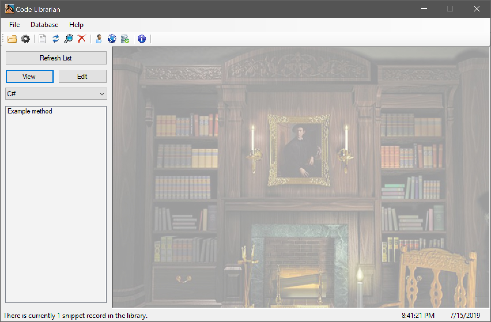

# Code Librarian

This program stores and organizes your code snippets for any programming language with its easy to use features. I originally built this snippet manager because I didn’t like the ones I saw on the Internet, so I decided to make my own. Code Librarian is very useful for people who are starting out in programming and for advanced programmers who need a place to store their code snippets for future reuse. The program was also designed to work with teams and with third-party code where crediting information will need to be saved.

Releases: [https://github.com/StevenJDH/Code-Librarian/releases](https://github.com/StevenJDH/Code-Librarian/releases)

Changelog: [https://github.com/StevenJDH/Code-Librarian/wiki/Changelog](https://github.com/StevenJDH/Code-Librarian/wiki/Changelog)

## Features
* Easily add, update, and delete your snippet records.
* Manage authors, contact info, and languages for those records.
* A snippet language filter to filter out everything except what you want to see.
* A built-in search engine that can search by keywords, languages, authors, or all three.
* Keyboard shortcuts for those who like them.
* Open other people's databases for viewing or editing.
* Choose either to have the list panel placed on the left or on the right side of the program for comfort.
* Create backups of the loaded database.
* Manage your personal database separately from everyone else in a multi-user environment.
* Auto and manually check for updates from within the program.

## Planned features
* Looking into providing syntax highlighting for the code snippets.
* Importing and exporting of snippet records.

## The database and EF6
Code Librarian will now use an SQLite database for its portability along with Entity Framework 6x using a partial Database First Approach since currently there are some limitations with SQLite. Below is an ERD of the database design for reference. 

## NSIS installer project
I've included the NSIS (Nullsoft Scriptable Install System) script that I wrote to create the installer for Code Librarian. The script was written with NSIS 3.04, which you can find here [http://nsis.sourceforge.net/Main_Page](http://nsis.sourceforge.net/Main_Page), and it may not work with earlier versions due to missing features in the scripting language. The Code Librarian installer supports installing the program for all users, the current user, or for both at the same time. Silent installs and uninstalls can also be performed, and a restriction of at least Windows 7 is imposed to meet requirements for the .Net Framework version used.

## Do you have any questions?
Many commonly asked questions are answered in the FAQ:
[https://github.com/StevenJDH/Code-Librarian/wiki/FAQ](https://github.com/StevenJDH/Code-Librarian/wiki/FAQ)

## Want to show your support?

|Method       | Address                                                                                                    |
|------------:|:-----------------------------------------------------------------------------------------------------------|
|PayPal:      | [https://www.paypal.me/stevenjdh](https://www.paypal.me/stevenjdh "Steven's Paypal Page")                  |
|Bitcoin:     | 3GyeQvN6imXEHVcdwrZwKHLZNGdnXeDfw2                                                                         |
|Litecoin:    | MAJtR4ccdyUQtiiBpg9PwF2AZ6Xbk5ioLm                                                                         |
|Ethereum:    | 0xa62b53c1d49f9C481e20E5675fbffDab2Fcda82E                                                                 |
|Dash:        | Xw5bDL93fFNHe9FAGHV4hjoGfDpfwsqAAj                                                                         |
|Zcash:       | t1a2Kr3jFv8WksgPBcMZFwiYM8Hn5QCMAs5                                                                        |
|PIVX:        | DQq2qeny1TveZDcZFWwQVGdKchFGtzeieU                                                                         |
|Ripple:      | rLHzPsX6oXkzU2qL12kHCH8G8cnZv1rBJh Destination Tag: 2357564055                                        |
|Monero:      | 4GdoN7NCTi8a5gZug7PrwZNKjvHFmKeV11L6pNJPgj5QNEHsN6eeX3D &#8618;aAQFwZ1ufD4LYCZKArktt113W7QjWvQ7CWDXrwM8yCGgEdhV3Wt|

// Steven Jenkins De Haro ("StevenJDH" on GitHub)
